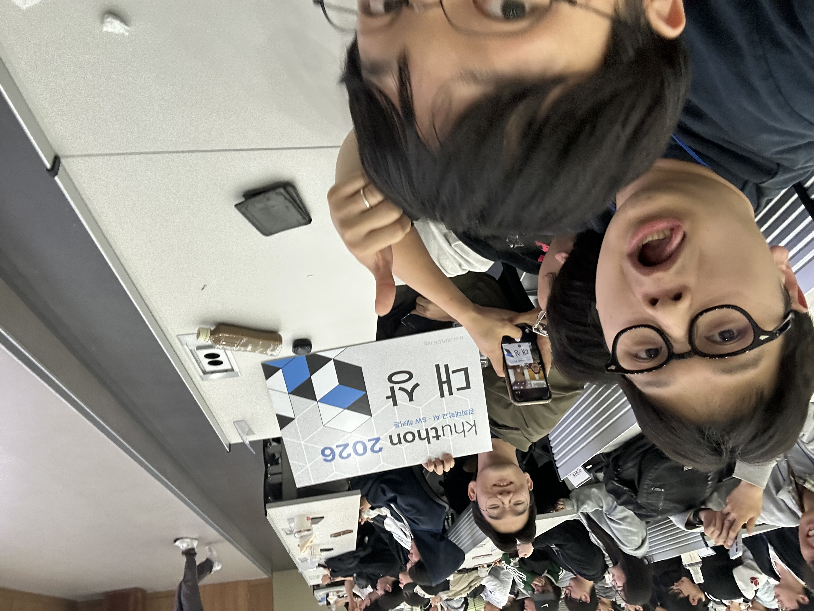

# 이음(匠) — 장인과 창작자를 잇다

> 전통 장인과 현대 창작자가 함께 협업 작품을 기획하고, 완성된 결과물을 대중에게 선보이는 플랫폼

---

## 🏆 2026 쿠톤(Khuthon) 대상



---

## 서비스 소개

이음은 세 가지 흐름으로 동작합니다.

```
장인 탐색 → 기획안 제출 → 운영자 매칭 → 작품 등록 → 선착순 판매
```

| 역할 | 설명 |
|------|------|
| **장인** | 전통 기술 보유자. 창작자의 기획안을 수락하고 제작에 참여합니다. |
| **창작자** | 상품 기획·판매 담당. 장인의 기술을 바탕으로 프로젝트를 제안합니다. |
| **운영자** | 기획안 심사·수락, 작품 등록을 관리합니다. |

정산은 **장인 40% / 창작자 40% / 플랫폼 20%** 로 구매 즉시 계산됩니다.

---

## 시연 영상


---

## 기술 스택


---

## 팀

**2026 쿠톤(Khuthon)** — 이음 팀  
전통과 현대를 연결하는 협업 플랫폼

박찬종 · 김병규 · 이승준 · 황진용